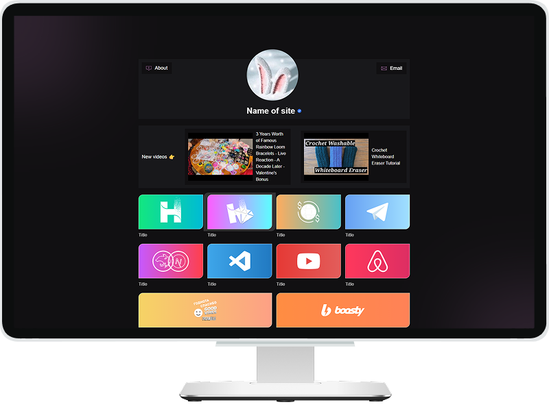

# Project name: Links

- This project fetches and displays data from **YouTube** channels (**latest video title**, **ID**, and **thumbnail**) by scraping HTML content (without using the YouTube API).

- It also retrieves and shows **dynamic data** (links and "About" description) from an **API**. The data is fetched at build time, and revalidation ensures it stays up-to-date.
- The app provides a clean, responsive interface using `Next.js` and `Tailwind CSS`, deployed on **Netlify** for easy access.

 

### 🧩 Tech Stack

 

